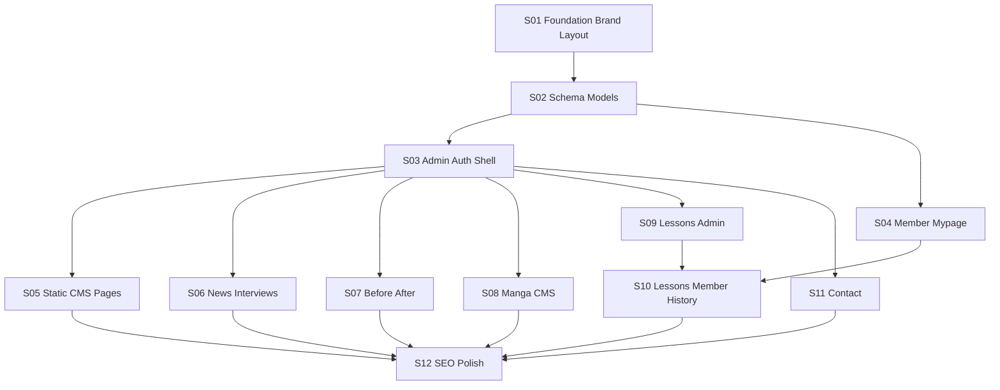

# JBA MVP Implementation Roadmap

Chat-sized sections for the JBA (Japanese Beauty Acupuncture) platform.
Stack: **Laravel 13 + Inertia.js + React 19 + Fortify + i18next (ja/en/zh)**.

## How to use

1. Open a **new chat**.
2. Open the matching prompt under [`prompts/`](prompts/).
3. Copy the prompt body (or `@`-reference the file).
4. Agent implements **only that section** until acceptance criteria pass.
5. Check the box below, then start the next chat.

Reference docs (local): `docs/design_guide.md`, `docs/JBA_要件定義書.md`.
Seeding guide: [`SEEDING.md`](SEEDING.md).

## Locked defaults

| Decision | Choice |
|---|---|
| Frontend | Laravel + Inertia (no separate SPA API) |
| DB | SQLite locally; migrations MySQL/PostgreSQL-compatible |
| Admin auth | Separate `admins` table + session guard |
| Email verification | `MustVerifyEmail` for members |
| Media | Laravel `Storage` on `public` disk (S3-ready later) |
| Manga | Viewer at `/manga`; `/` is the real top page |
| Content i18n | Translation tables for `ja` / `en` / `zh` |
| Seeds | Create a **separate** seeder file when a section needs data (no empty stubs upfront) |

## Suggested order

**S01 → S02 → S03 → S04**, then **S05–S09 / S11** in any order, then **S10 → S12**.

## Status

| Done | Section | Depends on | Prompt |
|:---:|---|---|---|
| [x] | **S01** Foundation: brand, public layout, move manga | — | [S01-foundation-brand-layout.md](prompts/S01-foundation-brand-layout.md) |
| [x] | **S02** Domain schema + models | S01 | [S02-schema-models.md](prompts/S02-schema-models.md) |
| [x] | **S03** Admin auth + admin shell | S02 | [S03-admin-auth-shell.md](prompts/S03-admin-auth-shell.md) |
| [x] | **S04** Member mypage polish | S02 | [S04-member-mypage.md](prompts/S04-member-mypage.md) |
| [x] | **S05** Static CMS pages (About / Counseling / Contraindications) | S03 | [S05-static-cms-pages.md](prompts/S05-static-cms-pages.md) |
| [x] | **S06** News + Interviews | S03 | [S06-news-interviews.md](prompts/S06-news-interviews.md) |
| [x] | **S07** Before / After gallery | S03 | [S07-before-after.md](prompts/S07-before-after.md) |
| [x] | **S08** Manga CMS (DB-backed viewer) | S03 | [S08-manga-cms.md](prompts/S08-manga-cms.md) |
| [x] | **S09** Lessons admin + storage | S03 | [S09-lessons-admin.md](prompts/S09-lessons-admin.md) |
| [x] | **S10** Member lessons + watch history | S04, S09 | [S10-lessons-member-history.md](prompts/S10-lessons-member-history.md) |
| [x] | **S11** Contact form | S03 | [S11-contact.md](prompts/S11-contact.md) |
| [x] | **S12** SEO + design polish | S05–S11 | [S12-seo-polish.md](prompts/S12-seo-polish.md) |

## Dependency graph

## Out of scope (Phase 2)

Payments, live streaming, certificates/quizzes, member tiers, traditional Chinese / Korean locales, advanced video DRM beyond basic auth-gated URLs.
